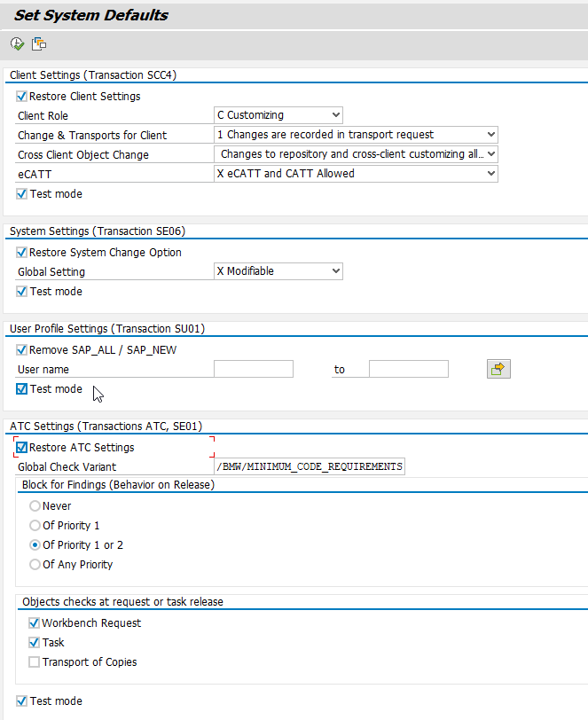

# System Defaults Restorer
This reports checks some basic settings of the SAP system and restores predefined values, if they have been changed. This allows to keep your SAP systems in a controlled state.

# Requirements
This tool has been developed on SAP Basis release 754 but will also work on  releases of 7.40 or later. 

# Usage
**BE CAREFUL!!! Usage of this report will change central settings of your SAP system. This can have a great impact on the users working on that system. Do not use this report without understanding the purpose of each setting!!!**
Schedule the report /BMW/OTD3110_SET_SYST_DEFAULTS with that variant on a daily basis outside operation hours. 

# Installation
Download the complete repository to your SAP system. 

## Create a selection variant
Define, which settings should be restored and produce a variant for that

**- Restore Client Settings**
Changes the settings in transaction *SCC4* depending on the role (development, test, production) of the current system to the given values. This prevents, that changes are created outside of the development system or without a transport request. The adjustment of *Client role* will affect several customizing and booking transactions. This might have impact on specific testing scenarios and disable some customizing functions in a non-development system. 

**- Restore System Change Option**
Changes the settings in transaction *SE06* to the given values. This prevents, that repository changes are carried out outside of the development system.

**- User Profile Settings**
This option will remove the profiles *SAP_ALL / SAP_NEW* from the selected users and by that, close any security gaps that have been opened by temporarily assigning these authorizations. 

**- ATC settings**
This option will restore the default check variant and the setting of the ATC TMS integration feature. 

# Known Issues
No known Issues so far. 

# Creator
This tool has been created by Madhuri Kalakonda and Thomas Kempfle for OtD Platform (FG-760).
